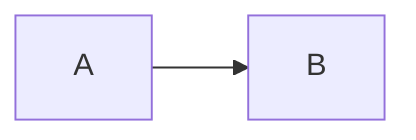

# Test

!!! note "A note"
    Body text.

??? warning "Collapsible"
    Hidden until clicked.

=== "Tab one"
    Content A

=== "Tab two"
    ```python
    print("nested code in a tab")
    ```


```mermaid
graph LR
  A --> B
```
